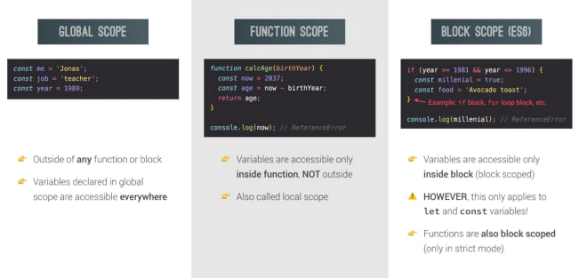
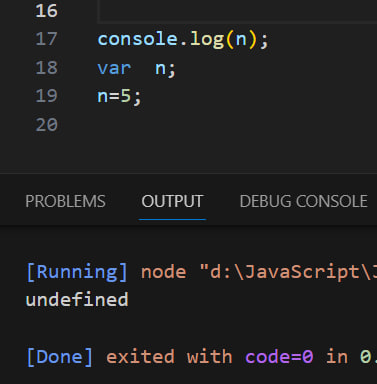
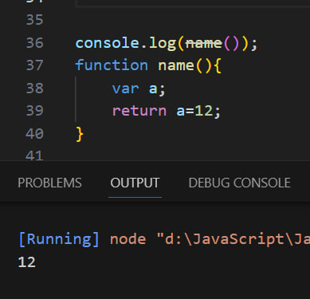

# SCOPE
### SCOPE in JavaScript
##### JavaScript has kinds of scopes:
>
>
###### • Global scope: The default scope for all code running in script mode.
###### • Function scope: The scope created with afunction.
###### •Block scope: This scope restricts the variable that is declared inside a specific block, from access by the  outside of the block.
###### • Module scope: The scope for code running in module mode.
>
>
>

>
>
>

# Hoisting 
#### What is Hoisting in JavaScript
Hoisting is a JavaScript mechanism where variables and function declarations are moved to the top of their scope before code execution.

Hoisting in JavaScript is a behavior in which a function or a variable
can be used before declaration.

>
>
### Hoisting - Variable (var)

###### Hoisting works on variable <-- var --> only but it shows undefined. Hoisting doesn't work on variable <-- let, const --> 

>
>

### Hoisting - in Function 

###### Hoisting works on function declaration only. Hoisting doesn't work on another functions 

