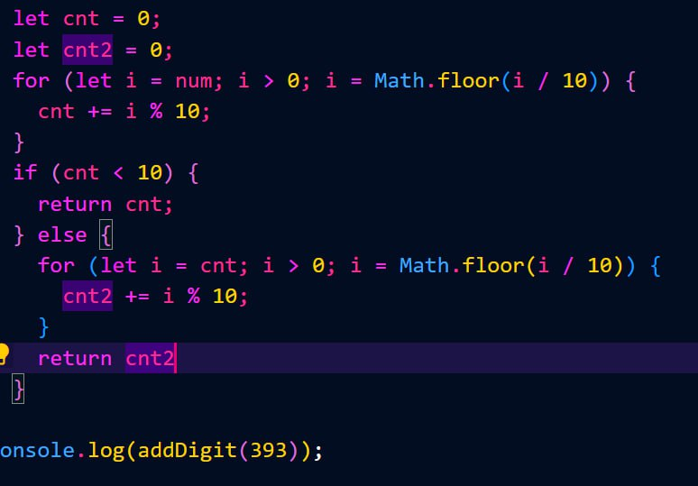

# SCOPE
### SCOPE in JavaScript
##### JavaScript has kinds of scopes:
>
>
###### • Global scope: The default scope for all code running in script mode.
###### • Function scope: The scope created with afunction.
###### •Block scope: This scope restricts the variable that is declared inside a specific block, from access by the outside of the block.
###### • Module scope: The scope for code running in module mode.
>
>

